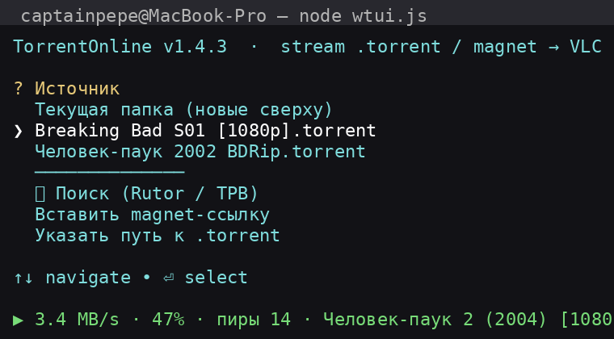

# TorrentOnline

**RU:** Стрим из `.torrent`, `magnet:` и ссылки на `.torrent` в **VLC** или прямо в **браузер**. Один процесс VLC на весь плейлист. Кэш чистится после выхода (отключается флагом).
**EN:** Stream from `.torrent`, `magnet:` and `.torrent` URLs to **VLC** or straight to the **browser**. One VLC process for the whole playlist. Cache is wiped on exit (disable with a flag).

[Русский](#русский) · [English](#english)



---

# Русский

## Быстрый старт
```bash
npx torrent-online
```
Глобально один раз:
```bash
npm i -g torrent-online && torrent-online
```
Из исходников:
```bash
git clone https://github.com/IamCaptainPepe/torrent-online.git
cd torrent-online
npm i
node wtui.js
```

CLI без меню (играют все видеофайлы торрента):
```bash
node wtui.js film.torrent
node wtui.js "magnet:?xt=urn:btih:..."
node wtui.js "https://example.com/file.torrent"
```

## Флаги
| Флаг | Что делает |
|---|---|
| `--keep-cache` | не удалять кэш после закрытия VLC |
| `--network-caching=<ms>` | прокинуть в VLC (по умолчанию 3000) |
| `--resume` | продолжить с прошлой позиции (VLC `--start-time`) |
| `--lan` | слушать 0.0.0.0 + токен в URL — смотреть с телефона/ТВ в сети |
| `--no-vlc` | только браузер-стриминг, без VLC |
| `--port=<N>` | фиксированный порт (иначе авто-поиск 8123..10122) |
| `--help` | справка |

Кэш по умолчанию: `~/Movies/WebTorrent`. **Внимание: папка кэша удаляется после выхода** (кроме `--keep-cache`) — промпт об этом предупреждает.

## Возможности (v1.4)
- 🔎 Поиск торрентов прямо в меню: **Rutor.info (по-русски)**, TPB.party (по-английски), опционально 1337x API
- 🌐 Стрим в браузер: страница с плеером на `/`, режим `--lan` с токеном
- 📺 Субтитры из торрента (`.srt/.ass/.ssa/.vtt`) → `--sub-file=` в VLC
- ▶️ `--resume`: позиция сохраняется в `~/.config/torrent-online/state.json`
- 📥 Watch-папка: `~/Downloads/torrent-online-watch` — бросил `.torrent`, подхватился в меню
- Прогресс-строка: `%`, скорость, пиры; таймаут метаданных magnet (60 с)
- Фильтр по имени (подстрока или `/regex/`) перед выбором файлов
- Проверка VLC на старте с внятной ошибкой

## .app (macOS)
`.app` открывает **Terminal** и запускает скрипт.
```bash
./build/app.sh
open dist/TorrentOnline.app
```
DMG по желанию:
```bash
brew install create-dmg
./build/app.sh
open dist/TorrentOnline.dmg
```

## Linux
```bash
# ярлык в меню приложений
cp build/torrent-online.desktop ~/.local/share/applications/
# поправь Exec= на путь к проекту (или замени %h на абсолютный путь)
```

## Docker (headless, стрим в браузер)
```bash
docker build -t torrent-online .
docker run -p 8123:8123 torrent-online node wtui.js "magnet:?xt=..." --lan --no-vlc --port=8123
# открой напечатанный URL (токен в нём)
```

## Требования
- macOS 11+ / Linux
- Node.js ≥ 18
- VLC (`/Applications/VLC.app` или в PATH) — не нужен с `--no-vlc`

## Частые вопросы
- **Node не виден из .app** — .app запускает `zsh -l`, PATH подтянется. Если нет — проверь `which node`.
- **«Writable stream closed prematurely»** — VLC рвёт пробные коннекты; мы их игнорим.
- **Порт занят** — авто-поиск в диапазоне 8123..10122 или `--port=`.
- **Magnet без пиров** — приложение отвалится через 60 с с понятной ошибкой, не будет висеть вечно.
- **Поиск по-русски** — Rutor ищет по кириллице сразу; TPB — только по-английски (транслит пробуем сами).

---

# English

## Quick Start
```bash
npx torrent-online
```
Install globally:
```bash
npm i -g torrent-online && torrent-online
```
From source:
```bash
git clone https://github.com/IamCaptainPepe/torrent-online.git
cd torrent-online
npm i
node wtui.js
```

CLI without the menu (all video files of the torrent play):
```bash
node wtui.js film.torrent
node wtui.js "magnet:?xt=urn:btih:..."
node wtui.js "https://example.com/file.torrent"
```

## Flags
| Flag | What it does |
|---|---|
| `--keep-cache` | don't delete the cache after VLC closes |
| `--network-caching=<ms>` | passed to VLC (default 3000) |
| `--resume` | continue from the last position (VLC `--start-time`) |
| `--lan` | listen on 0.0.0.0 + token in URL — watch from phone/TV on your network |
| `--no-vlc` | browser streaming only, no VLC |
| `--port=<N>` | fixed port (otherwise auto-scan 8123..10122) |
| `--help` | help |

Default cache: `~/Movies/WebTorrent`. **Note: the cache folder is deleted on exit** (unless `--keep-cache`) — the prompt warns about it.

## Features (v1.4)
- 🔎 Built-in torrent search: **Rutor.info (Russian)**, TPB.party (English), optional 1337x API
- 🌐 Browser streaming: player page at `/`, `--lan` mode with a token
- 📺 Subtitles from the torrent (`.srt/.ass/.ssa/.vtt`) → `--sub-file=` in VLC
- ▶️ `--resume`: playback position saved in `~/.config/torrent-online/state.json`
- 📥 Watch folder: `~/Downloads/torrent-online-watch` — drop a `.torrent`, it shows up in the menu
- Progress line: %, speed, peers; magnet metadata timeout (60 s)
- Name filter (substring or `/regex/`) before picking files
- VLC presence checked at startup with a clear error

## .app (macOS)
The `.app` opens **Terminal** and runs the script.
```bash
./build/app.sh
open dist/TorrentOnline.app
```
Optional DMG:
```bash
brew install create-dmg
./build/app.sh
open dist/TorrentOnline.dmg
```

## Linux
```bash
# app menu shortcut
cp build/torrent-online.desktop ~/.local/share/applications/
# fix Exec= to your project path (or replace %h with an absolute path)
```

## Docker (headless, stream to browser)
```bash
docker build -t torrent-online .
docker run -p 8123:8123 torrent-online node wtui.js "magnet:?xt=..." --lan --no-vlc --port=8123
# open the printed URL (token included)
```

## Requirements
- macOS 11+ / Linux
- Node.js ≥ 18
- VLC (`/Applications/VLC.app` or in PATH) — not needed with `--no-vlc`

## FAQ
- **Node not visible from the .app** — the .app runs `zsh -l`, PATH is picked up. If not — check `which node`.
- **"Writable stream closed prematurely"** — VLC drops probe connections; we ignore them.
- **Port busy** — auto-scan in 8123..10122 or use `--port=`.
- **Magnet with no peers** — the app fails after 60 s with a clear error instead of hanging forever.
- **Search in Russian** — Rutor searches Cyrillic directly; TPB is English-only (we try transliteration too).

## Структура / Structure
```
.
├─ wtui.js          # основной скрипт / main script (ESM)
├─ package.json
├─ LICENSE          # MIT
├─ Dockerfile
├─ build/
│  ├─ app.sh        # сборка .app (Terminal launcher)
│  └─ torrent-online.desktop
└─ README.md
```

## Лицензия / License
MIT
